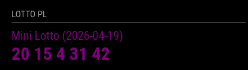

# MMM-PolishLotto

*MMM-PolishLotto* is a module for [MagicMirror²](https://github.com/MagicMirrorOrg/MagicMirror) that displays the latest draw results for the Polish National Lottery (Lotto), fetched directly from the official Totalizator Sportowy API.

## Screenshot



## Installation

### Install

In your terminal, go to the modules directory and clone the repository:

```bash
cd ~/MagicMirror/modules
git clone https://github.com/kaczmar986/MMM-PolishLotto
```

### Update

Go to the module directory and pull the latest changes:

```bash
cd ~/MagicMirror/modules/MMM-PolishLotto
git pull
```

## Configuration

To use this module, you have to add a configuration object to the modules array in the `config/config.js` file.

### Example configuration

Minimal configuration to use the module:

```js
  {
    module: "MMM-PolishLotto",
    position: "top_right",
    header: "Lotto PL",
    config: {
      // REQUIRED: Your API Key from developers.lotto.pl
      apiKey: "YOUR_API_KEY_HERE",
      gameType: "MiniLotto", // Options: 'MiniLotto', 'Lotto', 'EuroJackpot', 'LottoPlus', 'EkstraPensja', 'MultiMulti', 'Szybkie600', 'Keno', 'Kaskada'

      // OPTIONAL Configuration
      updateInterval: 6 * 60 * 60 * 1000, // Update every 6 hour
      
      // You can have the module check if your numbers were drawn
      yourNumbers: [{"MiniLotto":[1,2,3,4,5,6]}] 
    }
  },
```


### Configuration options

Option|Possible values|Default|Description
------|------|------|-----------
`exampleContent`|`string`|not available|The content to show on the page

## Sending notifications to the module

Notification|Description
------|-----------
`TEMPLATE_RANDOM_TEXT`|Payload must contain the text that needs to be shown on this module

## Developer commands

- `npm install` - Install devDependencies like ESLint.
- `node --run lint` - Run linting and formatter checks.
- `node --run lint:fix` - Fix linting and formatter issues.

## License

This project is licensed under the MIT License - see the [LICENSE](LICENSE.md) file for details.

## Changelog

All notable changes to this project will be documented in the [CHANGELOG.md](CHANGELOG.md) file.

## Disclamier 
This module is a fan-made project and is not affiliated with, endorsed by, or associated with Totalizator Sportowy Sp. z o.o. 
"Lotto" is a registered trademark of Totalizator Sportowy.
The data is retrieved from the public API provided by Totalizator Sportowy for informational purposes only.
This module is not a gambling tool and does not allow purchasing tickets.
